[options="header"]
[cols="1, 3, 3"]
|===
|Version | Bearbeitungsdatum   | Autor 
|0.1	| 13.11 | David L
|0.2	| 14.11 | Vivien
|0.3  | 16.11 | David
|0.4  | 16.11 | Christoph
|0.5  | 17.11 | Vivien
|===

= Entwicklerdokumentation

== Einführung und Ziele
* Aufgabenstellung

McTank ist nach einer Gesamtsanierung wieder für seine Kunden an der A555 geöffnet. Nachdem der 99-jährige Geschäftsführer an zu hohem Zigarettenkonsum entschlafen ist, verschwindet nun auch der lochkartengesteuerte Großrechner und wird durch einen neues System für die Verwaltung ersetzt. Sie wurden mit der Entwicklung dieses Systems betraut. Die vier Kundenanlaufpunkte (Mc-Points) McZapf, McDrive, McSit und McWash sollen zentral von der Software gesteuert werden. McZapf bezeichnet den Zapfsäulenbereich, McDrive und McSit beziehen sich auf das Fast-Food-Restaurant und McWash ist der Oberbegriff für die Pflegeeinrichtungen wie Waschanlage, Staubsauger, Druckluftgerät, etc. Die wichtigste Geschäftsidee des neuen Leiters von McTank ist die Einführung eines Rabatt- und Vorbestellungssystems. Die Kunden sollen telefonisch Vorbestellungen bei McSit und McWash tätigen können. MacZapf und McDrive werden aufgrund der schnellen Abarbeitungszeit nicht in die telefonische Reservierungsverwaltung eingegliedert. Das Rabattsystem bezieht sich dann allerdings auf alle Mc-Points. Man stelle sich das folgendermaßen vor: Ein Kunde soll bei Inanspruchnahme eines Dienstes eine Art Identifizierung erhalten, mit der er dann auch an den anderen Mc-Points einkaufen darf. Verläßt der Kunde das Gelände, muss er an einer der Mc-Points den Gesamtbetrag bezahlen, wobei sich der Rabatt folgendermaßen errechnet: Es werden die Typen der genutzten McPoints gezählt (also nicht die Anzahl der Nutzungen). Diese Zahl mit 5 multipliziert ergibt den Gesamtrabatt auf den Gesamteinkaufspreis. Weiterhin soll mit dem neuen System die Benzinlagerverwaltung gehandhabt werden. Um die Dienste zu optimieren und einen längerfristigen Kundenstamm zu gewinnen, zum Beispiel Wochenendfahrer, sollen die Fahrer über Ihr Autokennzeichen registrierbar sein. Diese Registrierung, für die dem Kunden ein einmaliger Sonderrabatt gewährt wird, ist lediglich eine Option und an jedem Mc-Point möglich, auch wenn bereits eine anonyme Identifizierung des Kunden an einem anderen McPoint vorgenommen wurde. Eine Gesamtabrechnung soll dann die in den letzten 100 Tagen getätigten Einkäufe aufgegliedert nach Kennzeichen anzeigen können. Jeweils am Jahresende sollen alle Kundendaten älter als 100 Tage gelöscht werden. Kunden, die ein Jahr lang nicht bei McTank eingekauft haben, werden aus der Datei entfernt. Ferner möchte der Leiter einen Überblick über die Auslastung seines Geschäftes erhalten.

* Qualitätsziele

Wartbarbeit: wie gut kann man die Anwendung warten

Erweiterbarkeit: wie gut sollen neue Features zu implementieren sein

Skalierbarkeit: Grad wie die Anwendung auf Vergrößerung des Unternehmens reagiert

Verlässlichkeit: Grad wie zuverlässig die Anwedung läuft

Performance: wie schnell soll die Software sein

Sicherheit: wie sicher soll die Software/die enthaltenen Daten sein

[cols="2"]
|===
| Wartbarkeit              | 3
| Erweiterbarkeit          | 2
| Benutzerfreundlichkeit   | 3
| Skalierbarkeit           | 4
| Verlässlichkeit          | 5
| Performance              | 5
| Sicherheit               | 2
|===

1 = niedrige Priorität,  5 = hohe Priorität

== Randbedingungen
* Hardware-Vorgaben +
Eine Aufzählung der notwendigen Geräte, mit denen man die Anwendung benutzen kann +
- Server +
- Computer +
- Maus +
- Tastatur +
- mobiles Gerät (z.B Tablet) +

* Software-Vorgaben +
Benötigte Software zum Benutzen der Anwendung: + 
Java Version: mind. Java 11 +
Browser Versionen: 
- Mozilla Firefox, version 55.0.3 +
- Google Chrome, version 61.0.3163 +

* Vorgaben zum Betrieb des Software +
Hier wird beschrieben, wie die Anwendung benutzt werden soll, wenn sie fertig ist und unter welchen Umständen.

Die Anwendung stellt die Website der Tankstelle McTank dar, auf die der Manager, die Mitarbeiter und die Kunden Zugriff haben. Dort können sich Kunden ein Benutzerkonto anlegen, dieses verwalten und sich immer ein- und ausloggen. Die Mitarbeiter bedienen mit dem System die Kasse und der Manager bekommt darüber Einsicht über die aktuellen Lagerbestände, getätigte Einkäufe und kann selber Bestellungen für die Lager tätigen. Die Software läuft über einen Server und kann im Internet von jedem zu jeder Zeit eingesehen werden.

Die Anwendung soll leicht erweiterbar sein und alle Daten werden persistent in einer Datenbank gespeichert und können über die Anwendung eingesehen werden.

== Kontextabgrenzung
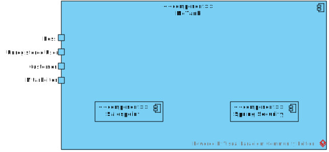

== Lösungsstrategie
=== Erfüllung der Qualitätsziele
[options="header"]
|=== 
|Qualitätsziel              |Lösungsansatz
|Wartbarkeit                a| * Modularität: Stellt bessere Überschaubarkeit sicher und es können einzelne Komponenten verändert/bearbeitet werden ohne Einfluss auf die ganze Anwendung zu haben. 
                              * Wiederverwendbarkeit: Einzelne Komponenten sollen für andere Aufgaben wiederverwendet werden können.

|Erweiterbarkeit           a| * Modularität: Es können leicht neuer Features in die Anwendung integriert werden. 
|Benutzerfreundlichkeit    a| * Es wird eine klares GUI geben, was die schnelle und leichte Bedinung der Anwendung ermöglicht
|Skalierbarkeit            a| * Modularität: Komponenten können bei Bedarf durch leistungsstärkere ersetzt werden.
|Verlässlichkeit           a| * Unit und Integrationstest: Die verlässlichkeit soll durch unfassende Tests gesichert werden.
|Performance               a| * Es werden die Laufzeiten der Anwendung überprüft z.B. in den Unittest. 
|Sicherheit                a| * Bestimmte Funktionen sind nur autorisierten Nutzern gestattet und die werden mit @RreAuthorize
überprüft.
                              * Bestellungen werden gespeichert und können zurückverfolgt werden.
|===

=== Softwarearchitektur
* Beschreibung der Architektur anhand der Top-Level-Architektur oder eines Client-Server-Diagramms

=== Entwurfsentscheidungen
* Verwendete Muster
  - Spring MVC
* Persistenz
  - Kundendaten und Rechnungen werden in einer H2 Datenbank von Spring gespeichert
* Benutzeroberfläche

* Verwendung externer Frameworks

[options="header", cols="1,3,3"]
|===
|Externe Klasse |Pfad der externen Klasse |Verwendet von (Klasse der eigenen Anwendung)
|salespointframework.catalog    |org.salespointframework.catalog.* |catalog.Catalog
|salespointframework.inventory  |org.salespointframework.inventory.* |inventory.Inventory
|salespointframework.quantity   |org.salespointframework.quantity.* |invnetory.Inventory
|salespointframework.SalespointSecurityConfiguration |org.salespointframework.SalespointSecurityConfiguration |mctank.WebSecurityConfiguration
|springframework.boot           |org.springframework.boot.SpringApplication |mctank.McTank
|springframework.ui             |org.springframework.ui.* |all Contoller
|springframework.validation     ||catalog.CatalogController
|springframework.web            |org.springframework.web.bind.* |mctank.McTankWebConfiguration
|===

== Bausteinsicht

=== McTank
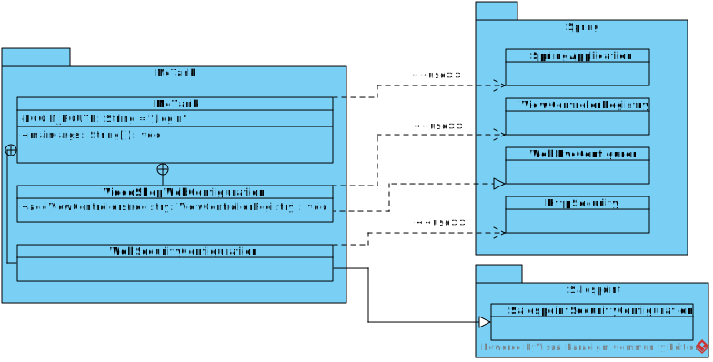

[options="header"]
|=== 
|Klasse/Enumeration |Description
|McTank | Spring container, bringt die Anwendung zum Laufen
|McTankWebConfiguration | leitet /login direkt zum login.html template
|WebSecurityConfiguration | baut die grundlegende Sicherheit und die Login/Logout Option auf
|===

=== Catalog
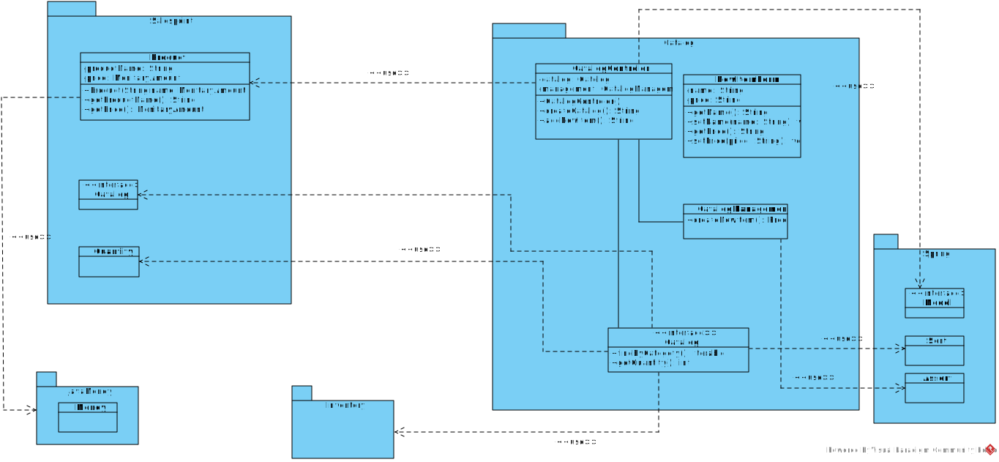

[options="header"]
|=== 
|Klasse/Enumeration |Description
|Catalog | listet alle Produkte der Firma nach McPoints sortiert auf
|CatalogContoller | ein Spring MVC Controller um Anfragen zu bearbeiten
|NewItemForm | nimmt die Daten für ein neues Item auf und validiert sie
|CatalogManagement | Klasse um Items zu organisieren und anzulegen
||
|===

=== Reservation
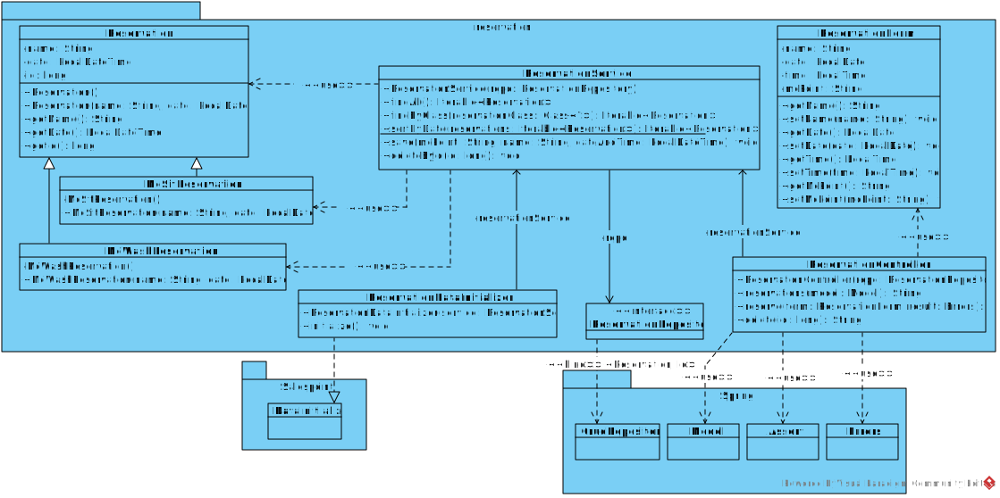

[options="header"]
|=== 
|Klasse/Enumeration |Description
|Reservation | repräsentiert eine Reservierung
|McSitReservation | erbt von Reservation, repräsentiert eine Reservierung bei McSit
|McWashReservation | erbt von Reservation, repräsentiert eine Reservierung bei McWash
|ReservationController | Spring Controller, bearbeitet Anfragen wie das Hinzufügen einer neuen Reservierung
|ReservationService | beinhaltet Funktionalitäten wie speichern, löschen oder sortieren
|ReservationRepository | Interface (Spring Crudrepository) zum speichern von Reservations
|ReservationDataInitializer | initialisiert die ReservationRepository
|ReservationForm | repräsentiert und validiert Eingaben des Nutzers
|===

=== Customer
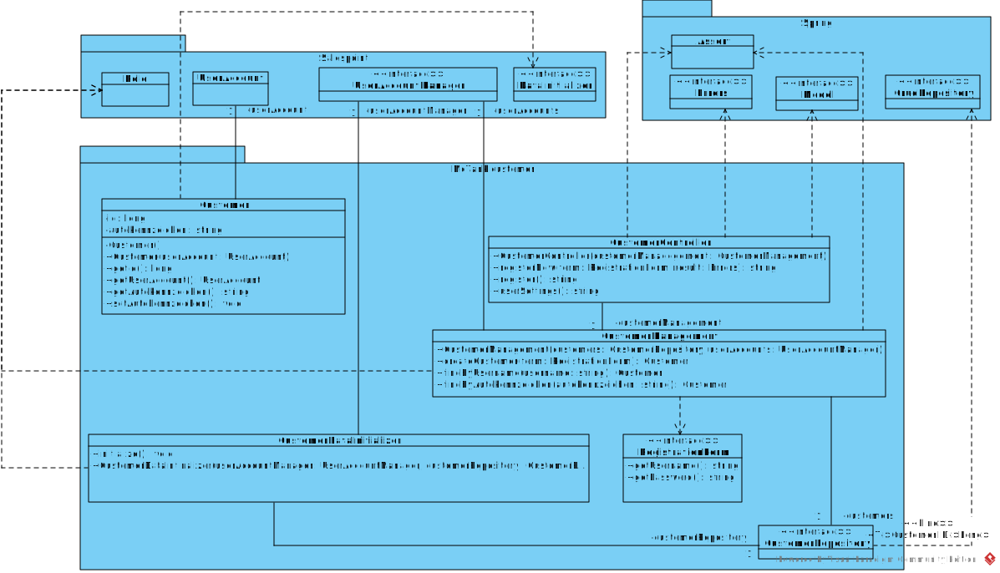

[options="header"]
|===
|Klasse/Enumeration|Description
|Customer | repräsentiert einen Kunden
|CustomerController | Spring MVC Controller um Anfragen bearbeiten
|CustomerRepository | Interface (Spring Crudrepository) zum speichern von Customers
|CustomerManagement | Service KLasse für Customer
|CustomerDataInitializer | erstellt USeraccounts für Mitabeiter und Boss eventuelle Bestandskunden
|RegistrationForm | repräsentiert und validiert Eingaben des Nutzers
|===

=== Inventory
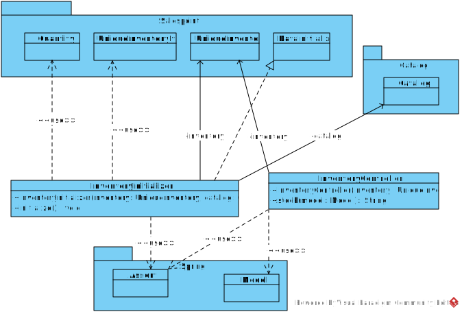

[options="header"]
|=== 
|Klasse/Enumeration |Description
|InventoryController | Spring Controller, stellt das Inventory für den Nutzer dar
|InventoryInitializer | initialisiert das Salespoint UniqueInventory
|===

=== Order
image:models/analysis/Order.svg[]

[options="header"]
|=== 
|Klasse/Enumeration |Description
|OrderController | Spring Controller, der den Warenkorb verwaltet
|Items | Catalog, listet Produkte auf, die in den Warenkorb hinzugefügt werden können
|===

[options="header"]
|=== 
|Klasse/Enumeration |Description
|===

=== Rückverfolgbarkeit zwischen Analyse- und Entwurfsmodell

[options="header"]
|===
|Klasse/Enumeration (Analysemodell) |Klasse/Enumeration (Entwurfsmodell)
|McTank | McTank
|Items  | Catalog
|Inventory | Inventory
|===

== Laufzeitsicht
* Komponentenbezogene Sequenzdiagramme, welche darstellen, wie die Anwendung mit externen Frameworks (zB. Salespoint, Spring) interagiert.

=== Catalog
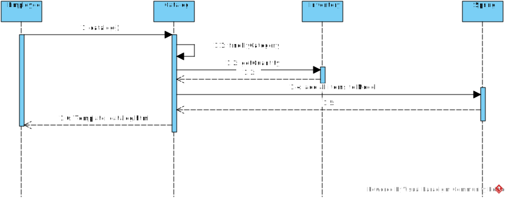

=== Inventory
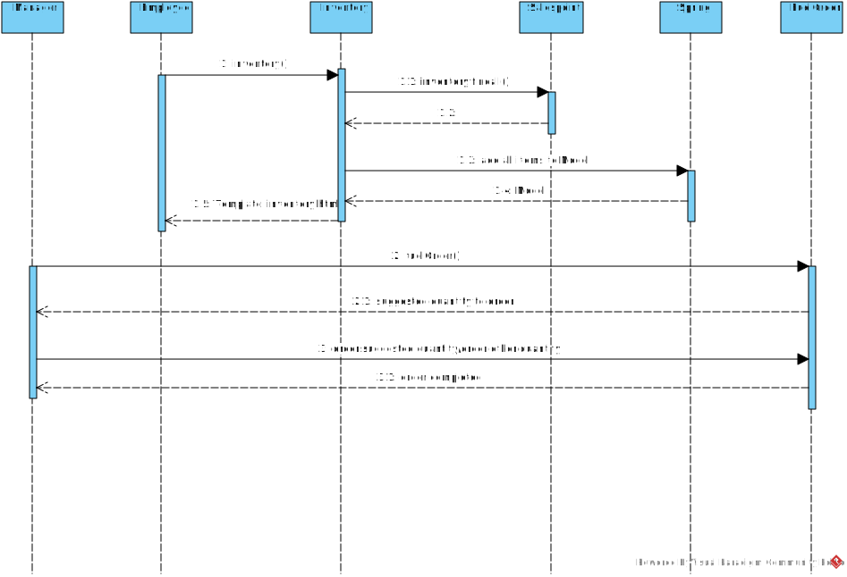

=== Reservation
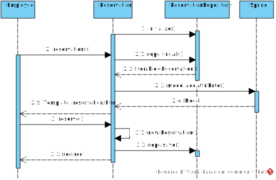

=== Customer
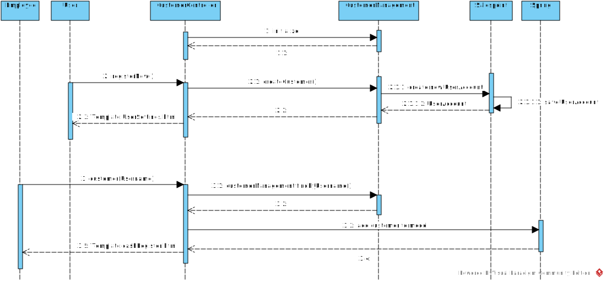

== Technische Schulden
* Auflistung der nicht erreichten Quality Gates und der zugehörigen SonarQube Issues

