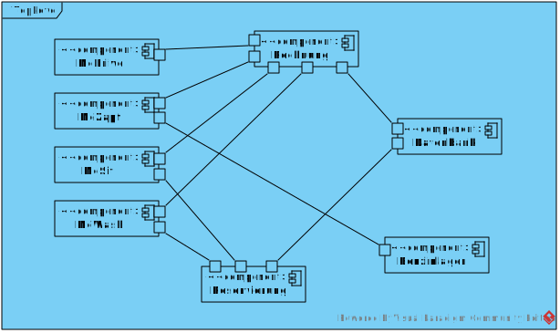
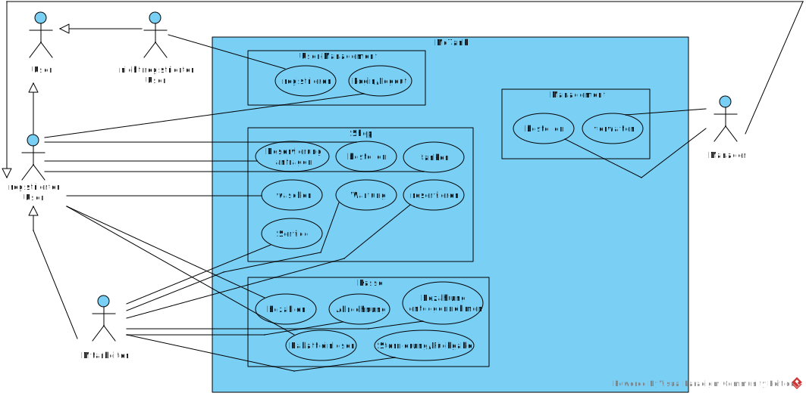

= Pflichtenheft
:project_name: Projektname
== __{project_name}__

[options="header"]
[cols="1, 1, 1, 1, 4"]
|===
|Version | Status      | Bearbeitungsdatum   | Autoren(en) |  Vermerk
|0.1     | In Arbeit   | 10.10.2019          | Autor       | Initiale Version
|0.1.1   | In Arbeit   | 31.10.2019          | David L     | Inhaltsverzeichnis, Interessengruppen, Nicht-Funktionale Anforderungen, Akteure hinzugefügt
|0.1.2   | In Arbeit   | 1.11.2019           | David L     | Muss-Kriterien hinzugefügt
|0.1.3   | In Arbeit   | 3.11.2019           | David L     | Aufgabenstellung hinzugefügt, Formatierung
|0.1.4   | In Arbeit   | 3.11.2019           | Vivien      | Anwendungsfälle und Akzeptanztestfälle hinzugefügt, Ergänzung funktionale Anforderungen, Zusammenfassung
|0.1.5   | In Arbeit   | 3.11.2019           | Christoph     | Top Level Diagramm hinzugefügt
|0.16    | In Arbeit   | 3.11.2019           | Clemens       | Kontext Diagramm verlinkt
|===

== Inhaltsverzeichnis
[cols="1"]
|===
|<<Zusammenfassung>>
|<<Aufgabenstellung und Zielsetzung>>
|<<Produktnutzung>>
|<<Interessensgruppen (Stakeholders)>>
|<<Systemgrenze und Top-Level-Architektur>>
|<<Anwendungsfälle>>
|<<Funktionale Anforderungen>>
|<<Nicht-Funktionale Anforderungen>>
|<<GUI Prototyp>>
|<<Datenmodell>>
|<<Akzeptanztestfälle>>
|<<Glossar>>
|<<Offene Punkte>>
|===

== Zusammenfassung
Dies ist unser Pflichtenheft zu unserer Aufgabe, eine Website für die Tankstelle "McTank" zu erstellen. Hier wird beschrieben, was die Anwendung können soll und wie wir bei der Bearbeitung vorgehen. Es dient dazu, am Ende sicherzustellen, dass alle gewünschten Anforderungen erfüllt worden sind. Das Pflichtenheft wird von Beginn an ausgefüllt, kann aber jederzeit erweitert oder abgeändert werden. 

== Aufgabenstellung und Zielsetzung
Text aus Aufgabenstellung kopieren und ggfs. präzisieren.
Insbesondere ergänzen, welche Ziele mit dem Abschluss des Projektes erreicht werden sollen.

McTank ist nach einer Gesamtsanierung wieder für seine Kunden an der A555 geöffnet. Nachdem der 99-jährige Geschäftsführer an zu hohem Zigarettenkonsum entschlafen ist, verschwindet nun auch der lochkartengesteuerte Großrechner und wird durch einen neues System für die Verwaltung ersetzt. Sie wurden mit der Entwicklung dieses Systems betraut.  Die vier Kundenanlaufpunkte (Mc-Points) McZapf, McDrive, McSit und McWash sollen zentral von der Software gesteuert werden. McZapf bezeichnet den Zapfsäulenbereich, McDrive und McSit beziehen sich auf das Fast-Food-Restaurant und McWash ist der Oberbegriff für die Pflegeeinrichtungen wie Waschanlage, Staubsauger, Druckluftgerät, etc.  Die wichtigste Geschäftsidee des neuen Leiters von McTank ist die Einführung eines Rabatt- und Vorbestellungssystems. Die Kunden sollen telefonisch Vorbestellungen bei McSit und McWash tätigen können. MacZapf und McDrive werden aufgrund der schnellen Abarbeitungszeit nicht in die telefonische Reservierungsverwaltung eingegliedert.  Das Rabattsystem bezieht sich dann allerdings auf alle Mc-Points. Man stelle sich das folgendermaßen vor: Ein Kunde soll bei Inanspruchnahme eines Dienstes eine Art Identifizierung erhalten, mit der er dann auch an den anderen Mc-Points einkaufen darf. Verläßt der Kunde das Gelände, muss er an einer der Mc-Points den Gesamtbetrag bezahlen, wobei sich der Rabatt folgendermaßen errechnet: Es werden die Typen der genutzten McPoints gezählt (also nicht die Anzahl der Nutzungen). Diese Zahl mit 5 multipliziert ergibt den Gesamtrabatt auf den Gesamteinkaufspreis.  Weiterhin soll mit dem neuen System die Benzinlagerverwaltung gehandhabt werden.  Um die Dienste zu optimieren und einen längerfristigen Kundenstamm zu gewinnen, zum Beispiel Wochenendfahrer, sollen die Fahrer über Ihr Autokennzeichen registrierbar sein. Diese Registrierung, für die dem Kunden ein einmaliger Sonderrabatt gewährt wird, ist lediglich eine Option und an jedem Mc-Point möglich, auch wenn bereits eine anonyme Identifizierung des Kunden an einem anderen McPoint vorgenommen wurde. Eine Gesamtabrechnung soll dann die in den letzten 100 Tagen getätigten Einkäufe aufgegliedert nach Kennzeichen anzeigen können. Jeweils am Jahresende sollen alle Kundendaten älter als 100 Tage gelöscht werden. Kunden, die ein Jahr lang nicht bei McTank eingekauft haben, werden aus der Datei entfernt.  Ferner möchte der Leiter einen Überblick über die Auslastung seines Geschäftes erhalten.  
 

== Produktnutzung
In welchem Kontext soll das System später genutzt werden? Welche Rahmenbedingungen gelten?
Zusätzlich kurze Einleitung für fachfremde Personen

Die Anwendung soll in einem Webbrowser genutzt werden, z.B mit:
  - Mozilla Firefox, version 55.0.3+
  - Google Chrome, version 61.0.3163+

== Interessensgruppen (Stakeholders)
Welche realen und juristischen Personen(-gruppen) haben Einfluss auf die Anforderungen im Projekt?

[cols="1"]
|===
|McTank GmbH
|Mitarbeiter von McTank
|Entwickler der Anwendung
|===

== Systemgrenze und Top-Level-Architektur

=== Kontextdiagramm
Das Kontextdiagramm zeigt das geplante Software-System in seiner Umgebung. Zur Umgebung gehören alle Nutzergruppen des Systems und Nachbarsysteme. Die Grafik kann auch informell gehalten sein. Überlegen Sie sich dann geeignete Symbole. Die Grafik kann beispielsweise mit Visio erstellt werden. Wenn nötig, erläutern Sie diese Grafik.
image:models/analysis/Kontext_Diagramm.vpp[]

=== Top-Level-Architektur
Dokumentieren Sie ihre Top-Level-Architektur mit Hilfe eines Komponentendiagramm.

== Anwendungsfälle

=== Akteure

Akteure sind die Benutzer des Software-Systems oder Nachbarsysteme, welche darauf zugreifen. Dokumentieren Sie die Akteure in einer Tabelle. Diese Tabelle gibt einen Überblick über die Akteure und beschreibt sie kurz. Die Tabelle hat also mindestens zwei Spalten (Akteur Name und Kommentar).
Weitere relevante Spalten können bei Bedarf ergänzt werden.

// See http://asciidoctor.org/docs/user-manual/#tables
[options="header"]
[cols="1,4"]
|===
|Name |Beschreibung
|Manager/Admin  |Chef der Firma, hat alle Berechtigungen
|Mitarbeiter    |Angestellter der Firman, hat erweiterten Zugriff
|registrierter Kunde | Kunde, kann nur seine Daten einsehen
|unregistrierter Kunde | Kunde, kann sich nur registrieren
|===

=== Überblick Anwendungsfalldiagramm

=== Anwendungsfallbeschreibungen
Dieser Unterabschnitt beschreibt die Anwendungsfälle. In dieser Beschreibung müssen noch nicht alle Sonderfälle und Varianten berücksichtigt werden. Schwerpunkt ist es, die wichtigsten Anwendungsfälle des Systems zu finden. Wichtig sind solche Anwendungsfälle, die für den Auftraggeber, den Nutzer den größten Nutzen bringen.
Für komplexere Anwendungsfälle ein UML-Sequenzdiagramm ergänzen.
Einfache Anwendungsfälle mit einem Absatz beschreiben.
Die typischen Anwendungsfälle (Anlegen, Ändern, Löschen) können zu einem einzigen zusammengefasst werden.

[cols="1h, 3"]
[[UC1]]
|===
|ID                          |**<<UC1>>**
|Name                        |Registrierung
|Beschreibung                |Ein nicht registrierter User kann sich einen eigenen Benutzeraccount erstellen
|Personen                    |Nicht registrierter User
|Auslöser                    |Der Benutzer kann sich auf der Website registrieren
|Voraussetzung(en)           |Das KFZ-Kennzeichen gehört noch keinem Benutzerkonto an, ist aber schon anonym registriert
|notwendige Schritte         |1. Der Benutzer drückt auf "Benutzerkonto anlegen" +
2. Er gibt sein KFZ-Kennzeichen, E-Mail-Adresse, Name, Zahlungsinformationen etc. ein +
3. Prüfung, ob das Kennzeichen schon registriert ist +
 wenn ja, Fehlermeldung +
 wenn nicht, Erstellung des Benutzerkontos
|Erweiterungen               |-
|Funktionale Anforderungen   |<<F2>>
|===

[cols="1h, 3"]
[[UC2]]
|===
|ID                          |**<<UC2>>**
|Name                        |Benzinbestellung
|Beschreibung                |Manager bestellt Benzin nach
|Personen                    |Manager
|Auslöser                    |Manager wird benachrichtigt, wenn die Lagerbestände unter 25% sind
|Voraussetzung(en)           |Lager ist nicht voll
|notwendige Schritte         |1. Manager bekommt automatische Benachrichtung, wenn Benzin nachbestellt werden muss +
2. Prognose bzw. Empfehlung, wie viel nachbestellt werden soll +
3. Manager entscheidet und bestellt 
|Erweiterungen               |-
|Funktionale Anforderungen   |<<F7>>
|===

[cols="1h, 3"]
[[UC3]]
|===
|ID                          |**<<UC3>>**
|Name                        |Rabatt für den Kunden
|Beschreibung                |Kunde löst Rabatte ein
|Personen                    |registrierter Kunde, Mitarbeiter
|Auslöser                    |Kunde erhält bei Registrierung einen einmaligen Rabatt in Höhe von 10% und zusätzlich gibt es pro genutzten McPoint 5% Rabatt
|Voraussetzung(en)           |Kunde ist registriert und nimmt mind. einen McPoint in Anspruch
|notwendige Schritte         |1. Kunde registriert sich +
2. nutzt einen McPoint +
3. erhält Rabatte
|Erweiterungen               |-
|Funktionale Anforderungen   |<<F1>>
|===

[cols="1h, 3"]
[[UC4]]
|===
|ID                          |**<<UC4>>**
|Name                        |Altersabfrage
|Beschreibung                |Kunde muss 18 sein, wenn er Zigaretten und Alkohol kaufen will
|Personen                    |Kunde, Mitarbeiter
|Auslöser                    |Kunde geht zur Kasse und möchte Alkohol und Zigaretten kaufen
|Voraussetzung(en)           |Kunde betritt McTank
|notwendige Schritte         |1. Kunde sucht sich gewünschte Waren (Alkohol, Zigaretten) aus und geht zur Kasse +
2. Kassensystem fordert Altersabfrage +
3. Mitarbeiter kontrolliert Ausweisdokument des Kunden 
|Erweiterungen               |-
|Funktionale Anforderungen   |
|===

[cols="1h, 3"]
[[UC5]]
|===
|ID                          |**<<UC5>>**
|Name                        |Login/Logout
|Beschreibung                |Ein Benutzer kann sich in sein Benutzerkonto einloggen und wieder ausloggen
|Personen                    |registrierter Benutzer
|Auslöser                    |Login: Benutzer meldet sich an, um mehr Funktionen zu nutzen +
Logout: Benutzer möchte Shop verlassen
|Voraussetzung(en)           |Login: Benutzer ist noch nicht authentifiziert +
Logout: Benutzer ist  authentifiziert
|notwendige Schritte         |Login: +
1. Benutzer geht auf "Login"-Button +
2. er gibt seine Anmeldedaten ein +
3. drückt auf "Bestätigen" +
Logout: +
1. Benutzer geht auf "Logout"-Button +
2. Benutzer ist nicht mehr authentifiziert und ihm wird die Startseite angezeigt
|Erweiterungen               |-
|Funktionale Anforderungen   |
|===

[cols="1h, 3"]
[[UC6]]
|===
|ID                          |**<<UC6>>**
|Name                        |Bestellungen ansehen
|Beschreibung                |Der Manager hat Übersicht über alle getätigten Bestellungen
|Personen                    |Manager
|Auslöser                    |Er wählt die Rubrik "Bestellungen" auf der Website aus
|Voraussetzung(en)           |Der Manager loggt sich erfolgreich auf der Website als Manager ein
|notwendige Schritte         |1. Er wählt die Rubrik "Bestellungen" auf der Website aus +
2. eine vollständige Liste aller getätigten Bestellungen wird angezeigt
|Erweiterungen               |-
|Funktionale Anforderungen   |<<F9>>
|===

[cols="1h, 3"]
[[UC7]]
|===
|ID                          |**<<UC7>>**
|Name                        |Tischreservierung
|Beschreibung                |Ein Kunde möchte einen Tisch bei McSit bestellen
|Personen                    |Kunde, Mitarbeiter
|Auslöser                    |Kunde ruft bei McSit an, um einen Tisch zu bestellen
|Voraussetzung(en)           |Kunde ruft Website von McTank auf und findet dort die notwendige Telefonnummer
|notwendige Schritte         |1. Kunde meldet sich telefonisch bei McSit und fragt eine Tischreservierung an +
2. Mitarbeiter prüft, ob ein Tisch zu der vom Kunden gewünschten Zeit frei ist +
wenn ja, Tisch wird reserviert +
wenn nein, Reservierung fehlgeschlagen
|Erweiterungen               |-
|Funktionale Anforderungen   |<<F3>>
|===
== Funktionale Anforderungen

=== Muss-Kriterien
Was das zu erstellende Programm auf alle Fälle leisten muss.

[options="header"]
[cols="3"]
|===
|ID |Kriterium            |Beschreibung
|[[F1]]<<F1>>|Rabattsystem         |Kunden bekommen für die Nutzung verschiedener McPoints Rabatt sowie bei Registrierung.
|[[F2]]<<F2>>|Kundenregistrierung  |Kunden müssen sich registrieren können.
|[[F3]]<<F3>>|Reservierungen       |Mitarbeiter müssen auf Kundenwunsch Reservierungen für McSit und McWash erstellen können.
|[[F4]]<<F4>>|Produktreklamation   |Kunden können Produkte zurückgeben. (außer Kraftstoff)
|[[F5]]<<F5>>|Kraftstoffverwaltung |Es soll eine Meldung an den Manager und die Tankstellenmitarbeiter geben, wenn die Kraftstofflager zur                   Neige gehen.
|[[F6]]<<F6>>|Prognose für Kraftstoff |Auf Grund des Verbrauchs der vergangenen Zeit soll es eine Empfehung geben, wie viel Kraftstoff für den Folgetag bestellt werden sollte.
|[[F7]]<<F7>>|Kraftstoffbestellung |Der Manager kann Kraftstoff bestellen, entweder nach der Empfehlung oder nach eigenem Ermessen.
|[[F8]]<<F8>>|Bezahlsystem         |Bei jedem Mitarbeiter können die Kunden bezahlen.
|[[F9]]<<F9>>|Verkaufshistorie     |Der Manager soll eine Aufstellung sehen, was in den letzten 100 Tagen verkauft wurde.
|[[F10]]<<F10>>|Kundenstammreinigung |registrierte Kunden die länger als ein Jahr nicht bei McTank eingekauft haben werden aus dem Datenbestand gelöscht.
|[[F11]]<<F11>>|Geschäftsauslastung  |Der Manager soll die Geschäftsauslastung einsehen können.
|===

=== Kann-Kriterien
Anforderungen die das Programm leisten können soll, aber für den korrekten Betrieb entbehrlich sind.

== Nicht-Funktionale Anforderungen

=== Qualitätsziele

[cols="1"]
|===
| Wartbarkeit: 3
| Erweiterbarkeit: 2
| Benutzerfreundlichkeit: 3
| Skalierbarkeit: 4
| Verlässlichkeit: 5
| Performance: 5
| Sicherheit: 2
|===

1 = niedrige Priorität  5 = hohe Priorität

Dokumentieren Sie in einer Tabelle die Qualitätsziele, welche das System erreichen soll, sowie deren Priorität.

=== Konkrete Nicht-Funktionale Anforderungen

Beschreiben Sie Nicht-Funktionale Anforderungen, welche dazu dienen, die zuvor definierten Qualitätsziele zu erreichen.
Achten Sie darauf, dass deren Erfüllung (mindestens theoretisch) messbar sein muss.

== GUI Prototyp

In diesem Kapitel soll ein Entwurf der Navigationsmöglichkeiten und Dialoge des Systems erstellt werden.
Idealerweise entsteht auch ein grafischer Prototyp, welcher dem Kunden zeigt, wie sein System visuell umgesetzt werden soll.
Konkrete Absprachen - beispielsweise ob der grafische Prototyp oder die Dialoglandkarte höhere Priorität hat - sind mit dem Kunden zu treffen.

=== Überblick: Dialoglandkarte
Erstellen Sie ein Übersichtsdiagramm, das das Zusammenspiel Ihrer Masken zur Laufzeit darstellt. Also mit welchen Aktionen zwischen den Masken navigiert wird.
//Die nachfolgende Abbildung zeigt eine an die Pinnwand gezeichnete Dialoglandkarte. Ihre Karte sollte zusätzlich die Buttons/Funktionen darstellen, mit deren Hilfe Sie zwischen den Masken navigieren.

=== Dialogbeschreibung
Für jeden Dialog:

1. Kurze textuelle Dialogbeschreibung eingefügt: Was soll der jeweilige Dialog? Was kann man damit tun? Überblick?
2. Maskenentwürfe (Screenshot, Mockup)
3. Maskenelemente (Ein/Ausgabefelder, Aktionen wie Buttons, Listen, …)
4. Evtl. Maskendetails, spezielle Widgets

== Datenmodell

=== Überblick: Klassendiagramm
UML-Analyseklassendiagramm
image:models/analysis/McTankDiagrams.vpp[]
=== Klassen und Enumerationen
Dieser Abschnitt stellt eine Vereinigung von Glossar und der Beschreibung von Klassen/Enumerationen dar. Jede Klasse und Enumeration wird in Form eines Glossars textuell beschrieben. Zusätzlich werden eventuellen Konsistenz- und Formatierungsregeln aufgeführt.

// See http://asciidoctor.org/docs/user-manual/#tables
[options="header"]
|===
|Klasse/Enumeration |Beschreibung |
|…                  |…            |
|===

== Akzeptanztestfälle
Mithilfe von Akzeptanztests wird geprüft, ob die Software die funktionalen Erwartungen und Anforderungen im Gebrauch erfüllt. Diese sollen und können aus den Anwendungsfallbeschreibungen und den UML-Sequenzdiagrammen abgeleitet werden. D.h., pro (komplexen) Anwendungsfall gibt es typischerweise mindestens ein Sequenzdiagramm (welches ein Szenarium beschreibt). Für jedes Szenarium sollte es einen Akzeptanztestfall geben. Listen Sie alle Akzeptanztestfälle in tabellarischer Form auf.
Jeder Testfall soll mit einer ID versehen werde, um später zwischen den Dokumenten (z.B. im Test-Plan) referenzieren zu können.

[cols="1h, 4"]
|===
|ID                    |<<AT1>>
|Anwendungsfall        |<<UC1>>
|Voraussetzung(en)     |Ein nicht registrierter User will ein Benutzerkonto erstellen
|Ereignis              |Der Benutzer drückt auf "Benutzerkonto anlegen" und gibt die folgenden Daten ein +
1. Kennzeichen: DD-VB-11111
|erwartetes Ergebnis   |Fehlermeldung, da falsches Kennzeichen (entspricht nicht den europäischen Richtlinien)
|===

[cols="1h, 4"]
|===
|ID                    |<<AT2>>
|Anwendungsfall        |<<UC2>>
|Voraussetzung(en)     |Manager will Benzin nachbestellen
|Ereignis              |Manager startet Bestellvorgang und gibt die folgenden Bestelldaten ein: +
1. Benzin: 50.200 Liter +
2. Diesel: 30.000 Liter +
3. E10: 20.564 Liter
|erwartetes Ergebnis   |Fehlermeldung, da Bestellmenge von Benzin zu hoch (jeder Tank hat jeweils max. 50.000 Liter Füllmenge) 
|===

[cols="1h, 4"]
|===
|ID                    |<<AT3>>
|Anwendungsfall        |<<UC3>>
|Voraussetzung(en)     |Kunde löst Rabatt an Kasse bei Mitarbeiter ein
|Ereignis              |1. Der Kunde hat 4 McPoints in Anspruch genommen und will seinen Startrabatt einlösen +
2. Mitarbeiter gibt einen Rabatt von 40% in die Kasse ein
|erwartetes Ergebnis   |Fehlermeldung, da Rabatt in keinem Fall höher als 30% sein kann 
|===

[cols="1h, 4"]
|===
|ID                    |<<AT4>>
|Anwendungsfall        |<<UC4>>
|Voraussetzung(en)     |Kunde will Zigaretten und Alkohol kaufen
|Ereignis              |1. Der Kunde geht zur Kasse und will Zigaretten und Alkohol kaufen +
2. Kasse fordert Altersabfrage +
3. Mitarbeiter prüft Ausweisdokument und sieht, Kunde ist erst 17
|erwartetes Ergebnis   |Fehlermeldung, da Kunde zu jung 
|===

[cols="1h, 4"]
|===
|ID                    |<<AT5>>
|Anwendungsfall        |<<UC5>>
|Voraussetzung(en)     |ein authentifizierter Benutzer nutzt das System
|Ereignis              |er drückt den "Ausloggen"-Button
|erwartetes Ergebnis   |er ist nicht mehr authentifiziert und verliert den Zugriff auf alle Funktionalitäten, die für authentifizierte Nutzer bestimmt sind 
|===

[cols="1h, 4"]
|===
|ID                    |<<AT7>>
|Anwendungsfall        |<<UC7>>
|Voraussetzung(en)     |ein Kunde will einen Tisch bei McSit reservieren
|Ereignis              |1. er ruft bei McSit an, um eine Reservierung am kommenden Tag um 15:00 Uhr anzufragen +
2. Mitarbeiter prüft, ob ein Tisch zu dieser Zeit frei ist +
3. Mitarbeiter bestätigt Reservierung
|erwartetes Ergebnis   |Der Tisch ist am nächsten Tag für 15:00 Uhr reserviert. Wenn der Kunde mehr als 15 Minuten zu spät kommt, wird die Reservierung aufgelöst und der Tisch weitervergeben
|===

== Glossar
Sämtliche Begriffe, die innerhalb des Projektes verwendet werden und deren gemeinsames Verständnis aller beteiligten Stakeholder essentiell ist, sollten hier aufgeführt werden.
Insbesondere Begriffe der zu implementierenden Domäne wurden bereits beschrieben, jedoch gibt es meist mehr Begriffe, die einer Beschreibung bedürfen. +
Beispiel: Was bedeutet "Kunde"? Ein Nutzer des Systems? Der Kunde des Projektes (Auftraggeber)?

== Offene Punkte
Offene Punkte werden entweder direkt in der Spezifikation notiert. Wenn das Pflichtenheft zum finalen Review vorgelegt wird, sollte es keine offenen Punkte mehr geben.
